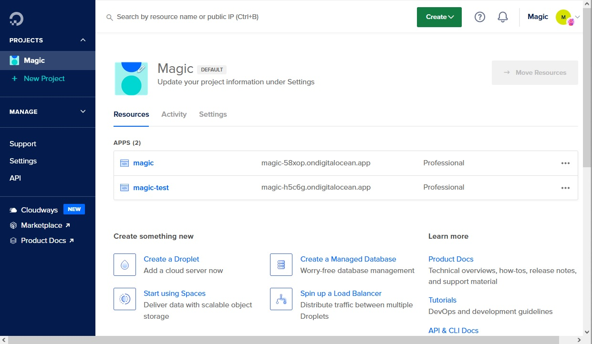
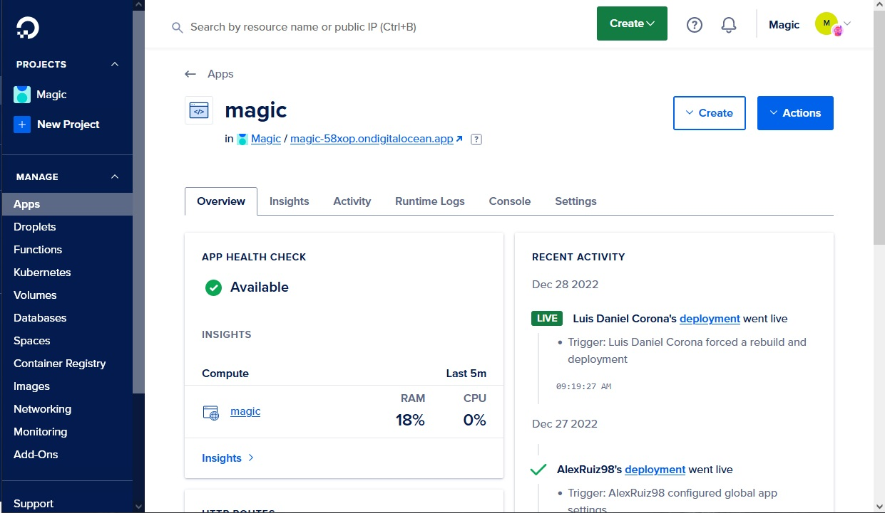
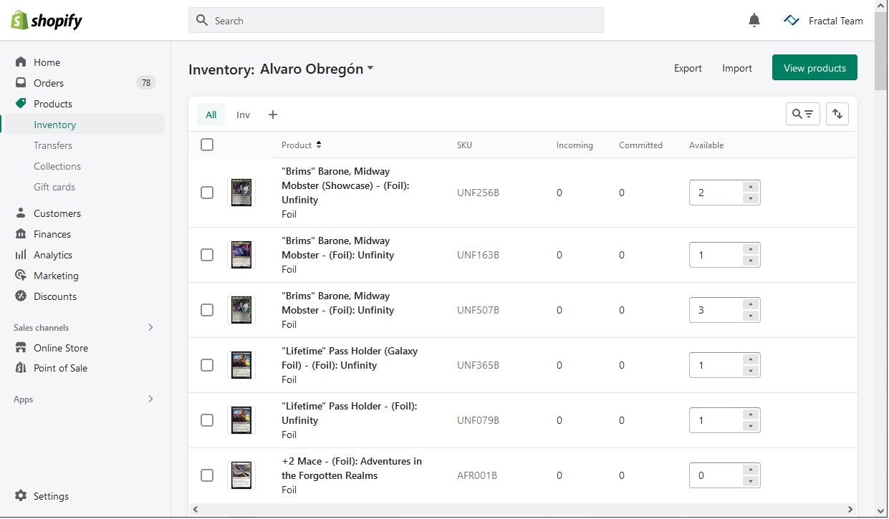
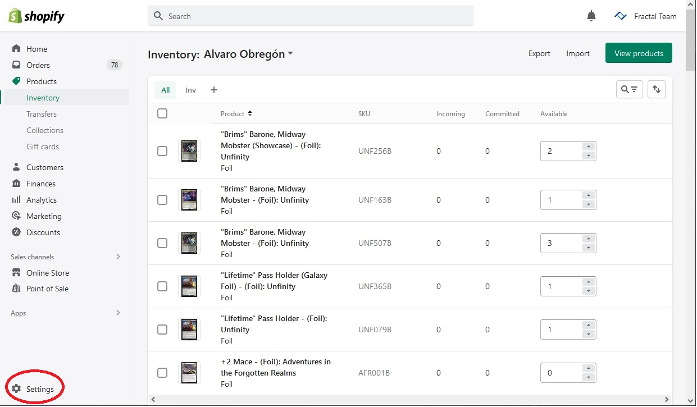
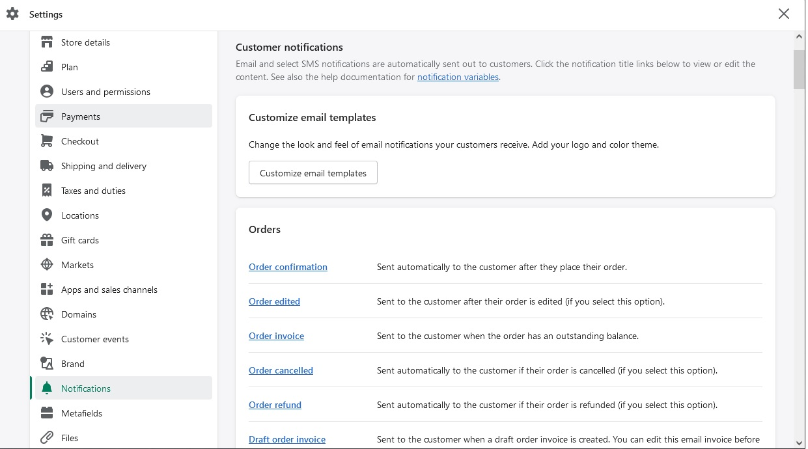
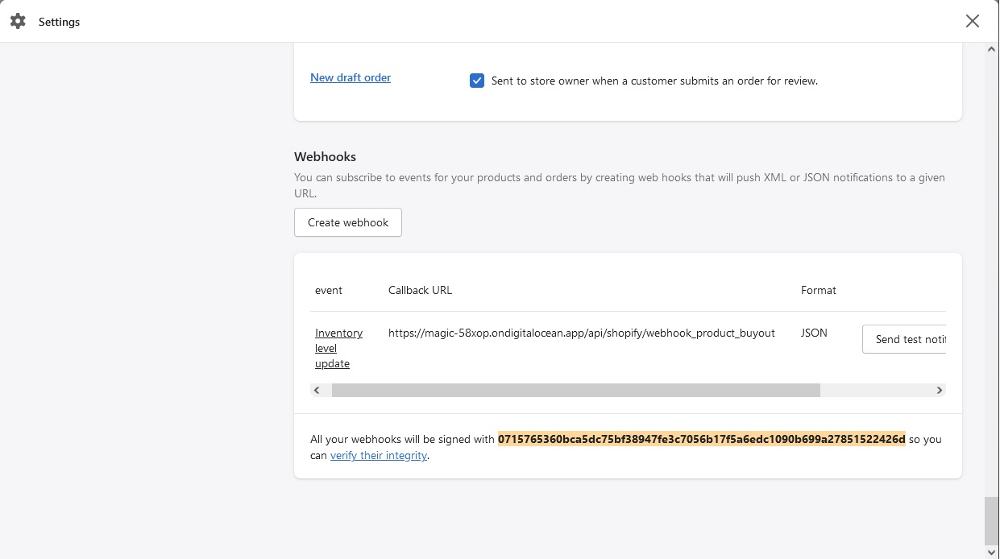
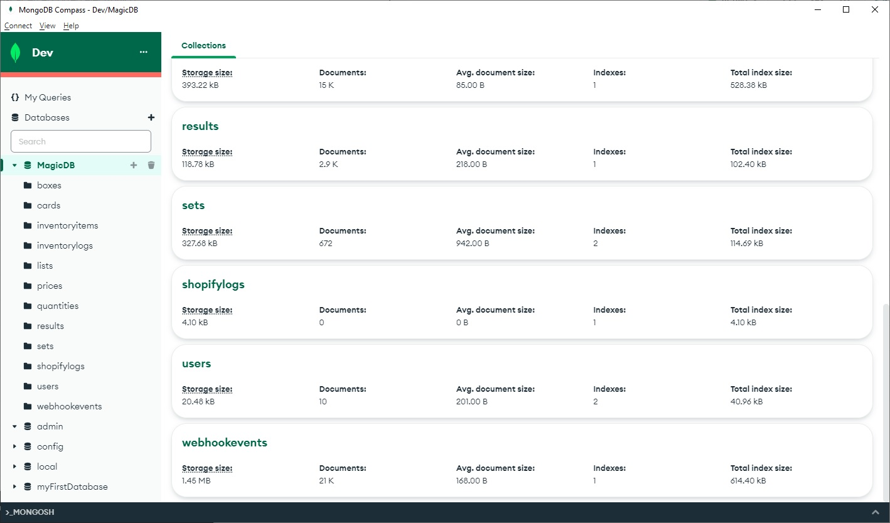

In this section, we'll talk about how to initiate a new feature for the repository and how to deploy the changes for production and/or development servers.

## Working on a new feature

The process to add a new feature for the repository, starts with creating a new branch from the "development" branch with the following commands in the root folder:

```bash
git branch nameOfBranch
git checkout nameOfBranch
```
Now we are working on a new branch for freely make changes in the files.

When we have made all of the changes, we must make a commit of the changes and ask for a review, making a pull request of the branch; if we receive corrections, we must work on fixing the reported issues over the same pull request. Once we have fixed all of the issues or bugs, our branch will be merged into "development" branch and once every feature is tested, the "development" branch will be merged into "master" branch.

## Deployment of the repository

Besides the repository is a monorepo, we need two different platforms to deploy this project, one for server and other for webapp.

### Server - Digital Ocean
For server deployment, we will use the Digital Ocean platform, that is a cloud hosting provider that offers cloud computing services and Infrastructure as a Service (IaaS).
Digital Ocean already has a "Magic" project, configured with two apps: **magic** and **magic-test**, for production and development testing. Every app is linked to the GitHub's repository, and is pointed to its corresponding branch.


Selecting an app, we can manage all of the settings of the server and see the recent activity. For Magic platform, we already have apps cofigured.


For more details, you can check the Digital Ocean's documentation here: **[https://docs.digitalocean.com/products/app-platform/reference/buildpacks/](https://docs.digitalocean.com/products/app-platform/reference/buildpacks/)**.

### Client - Vercel
For the website deployment, we will use Vercel, that is a popular platform for front-end deployments, providing speed and reliability. As Digital Ocean, Vercel is already configured with a site for production and other for testing, and, as with Digital Ocean, is linked to the GitHub repository and corresponding branch.

For more details, you can check the Vercel's documentation here: **[https://vercel.com/docs](https://vercel.com/docs)**.

Both platforms are automatically updated, when the pointed branch report changes, as when a pull request is accepted and branches are merged, besides some exceptions when the platform fails to deploy the changes, then we must do a manual update.

## Shopify
Shopify is a leading e-commerce platform that allows individuals and businesses to create and manage their own online stores. It offers a variety of features including customizable templates, secure payment processing, inventory management, and analytics tools. It also offers integration with various third-party apps and services to extend the functionality of the store.

This project is linked to the e-commerce **[https://bazaartcg.cards/](https://bazaartcg.cards/)** through funtions that update automatically prices and stock of the cards, but there they can also be updated manually; and through webhooks that notify of inventory changes. 

### Manual Inventory Managment
Besides the automatization of inventories, there are cases that must be corrected manually in the Shopify inventory, in this section:

In this page, we can export the inventory to a .csv file for a full details review.

### Webhooks
We can edit or create webhooks, registering them in the **Settings** section.






For more details about the Shopify features and functions, you can visit its help center website **[https://help.shopify.com/en/](https://help.shopify.com/en/)**.

## MongoDB
MongoDB is a cross-platform, document-oriented database that stores data in binary JSON format and allows for dynamic schema. It is known for its scalability, high performance, and ease of use; and it is a popular NoSQL database choice for many modern applications.

_Magic_ uses MongoDB, with these collections:  
    -**[boxes](/docs/Server/src/models/Box.md)**  
    -**[cards](/docs/Server/src/models/Card.md)**  
    -**[inventoryitems](/docs/Server/src/models/InventoryItem.md)**  
    -**[inventorylogs](/docs/Server/src/models/InventoryLog.md)**  
    -**[lists](/docs/Server/src/models/List.md)**  
    -**[prices](/docs/Server/src/models/Price.md)**  
    -**quantities**  
    -**results**  
    -**[sets](/docs/Server/src/models/Set.md)**  
    -**[shopifylogs](/docs/Server/src/models/ShopifyLog.md)**  
    -**[users](/docs/Server/src/models/User.md)**  
    -**[webhookevents](/docs/Server/src/models/WebhookEvent.md)**  

You need **MongoDB Compass** installed to manage the database.  



For more info about queries and data managment, you can visit MongoDB Manual **[https://www.mongodb.com/docs/manual/](https://www.mongodb.com/docs/manual/)**.